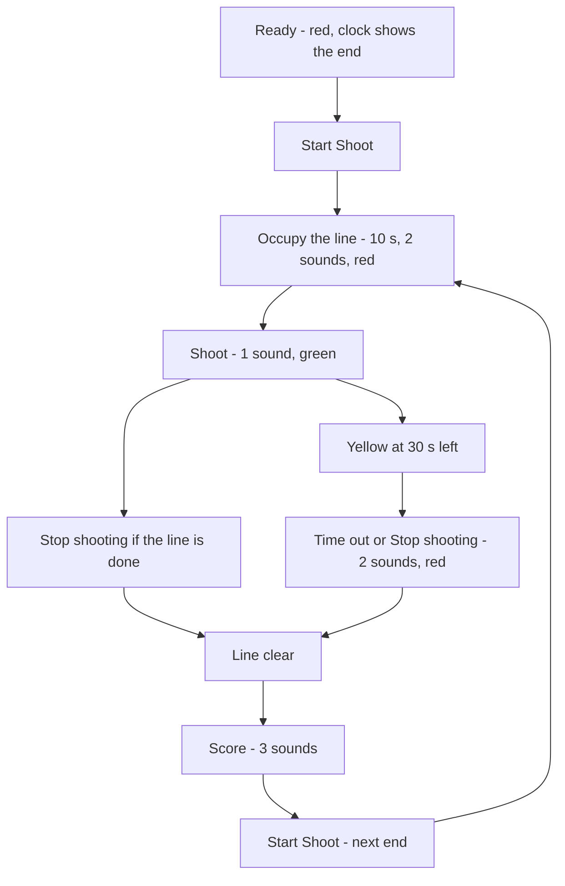
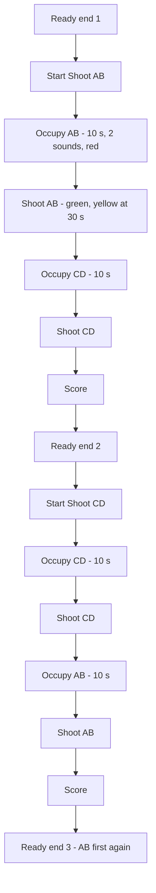
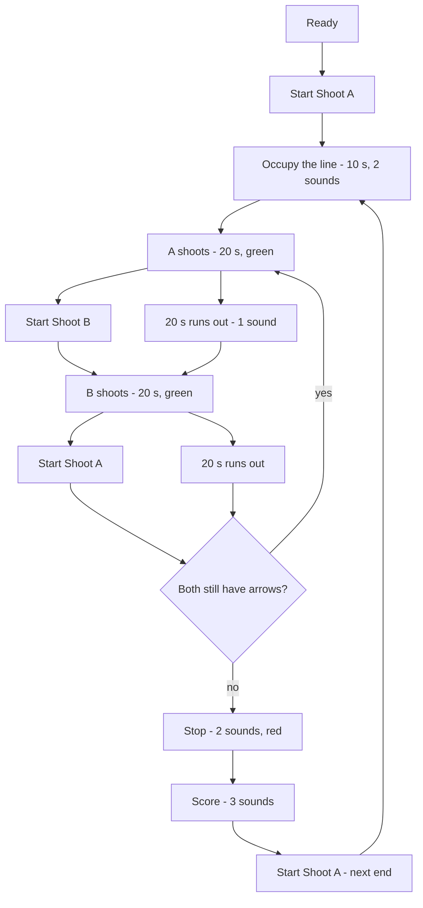
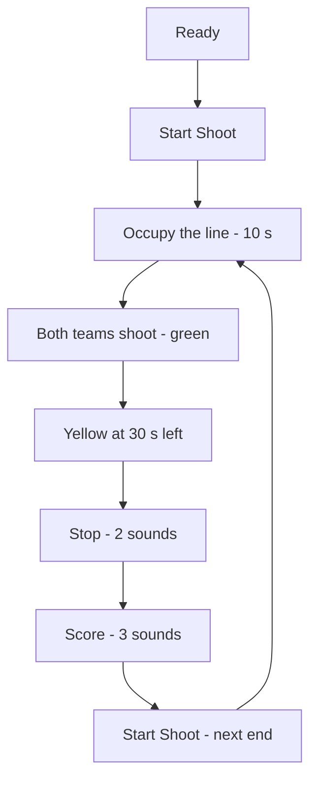
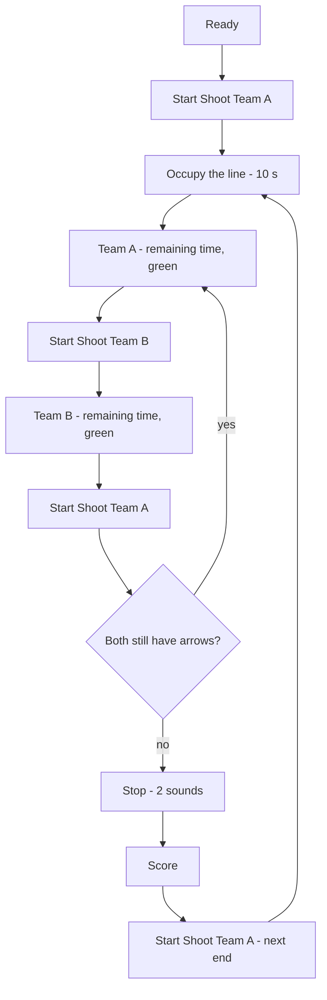
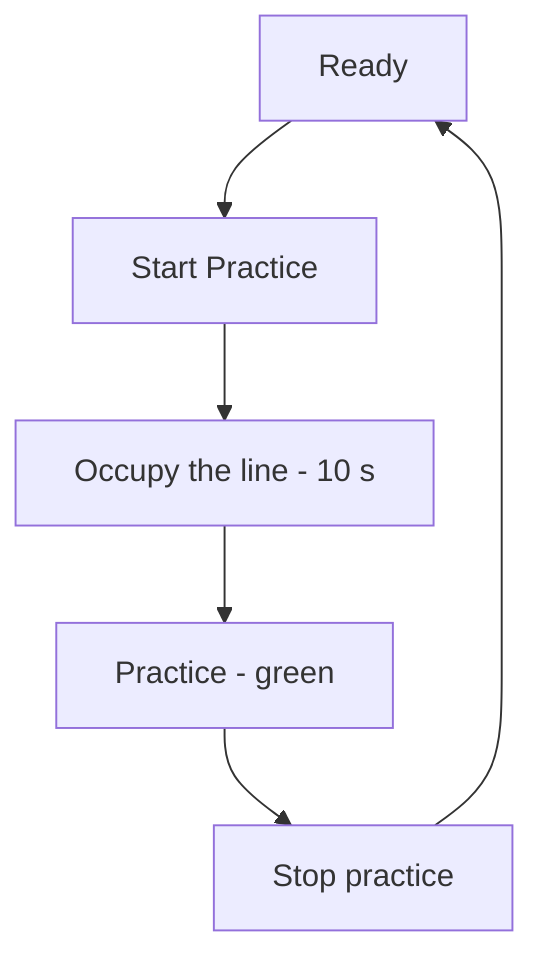
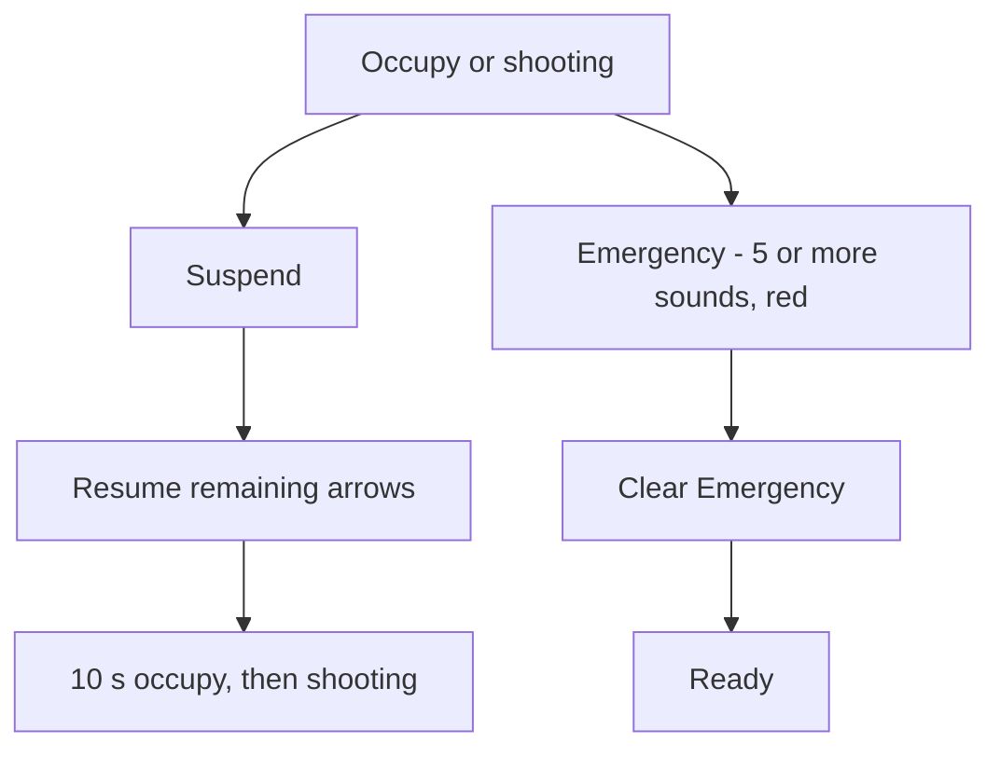

# Timing programs

Each program is the World Archery Book 3 shooting sequence for one kind of
end. Lights and sound counts are the same everywhere; who is on the line and
when the clock is handed over is what changes.

The digital clock is authoritative if a light ever disagrees (Art. 11.3.1).

Signals the field hears:

| Event | Sounds | Light |
|---|---|---|
| Occupy the line | 2 | Red |
| Start shooting | 1 | Green |
| Thirty seconds left | none | Yellow |
| Stop shooting | 2 | Red |
| Score | 3 | Red |
| Resume after a hold | 1 | then occupy or green |
| Emergency | 5 or more | Red |

Yellow is visual only, and is not used in alternating shooting or practice.

---

## Individual qualification (both details together)

Turn **AB / CD rotation** off for this. One clock for everyone on the line.
Typical when a club shoots a single detail. Time is arrows × 40 s, or 30 s at
an announced / ranking event.

Operator buttons follow the next stage: **Start Shoot**, **Stop shooting**,
**Score**, then **Start Shoot** again. **Emergency** is always available.

---

## Individual qualification with AB / CD rotation

This is the default. Art. 11.2.3.1: two details share the target. Odd ends
start AB then CD; even ends start CD then AB. After both details have shot,
arrows are scored. The 10 s changeover is the same occupy signal as the start
of an end.

**Start Shoot CD** on an odd end is the director ending AB early so CD can
take the line. When the first group’s clock reaches zero the same changeover
starts on its own.

A third or fourth detail, if configured, is named EF then GH and uses the
same occupy → shoot → next detail pattern.

---

## Individual match, alternating

Art. 11.2.3.2: twenty seconds for one arrow, then the other athlete. The
higher-placed athlete chooses who shoots first. There is no yellow warning.

**Start Shoot A/B** is one action: this clock stops and the opponent’s
starts. If the director misses the press, the timeout does the same handoff
so the match keeps its rhythm.

When several matches share a field, the period signal can be switched off
(Art. 11.3.4). A timeout still sounds.

---

## Team, both sides together

Art. 11.1.4.2: six arrows, 20 s each (120 s). Mixed team is four arrows
(80 s). Both sides shoot on the same clock.

---

## Team match, alternating

Art. 11.1.4.3: each team owns an allowance that stops and restarts. A turn
is three arrows (two for a mixed team). The unused time is banked, not
thrown away.

The first-to-shoot side is the one the higher-placed team chose.

---

## Practice

Chapter 14: the director starts and stops a period. There is no per-arrow
structure and no yellow warning. Length is a setup value.

---

## Holds and emergency

These cut across every program.

Suspend recalculates the allowance from arrows not shot (Art. 11.2.4).
Individuals get a flat per-arrow time; teams keep the clock only if it is
still above 20 s per unshot arrow. By default the 10 s occupy signal is
replayed before shooting continues.

The live arrow count and Add / Remove one arrow stay hidden on a
qualification or other simultaneous line. They appear throughout
alternating shooting, and on a hold in any program so the director can
set how many arrows have already been shot before resume.

Emergency is the one control that is always offered. It does not wait for
the current phase.

---

## How the console names the next press

The field page hides every control the current phase refuses. The label is
the event the athletes will hear and see, not the internal phase name.

| Situation | Button |
|---|---|
| Ready, AB/CD on | Start Shoot AB |
| Ready, even end, AB/CD on | Start Shoot CD |
| Ready, alternating, A first | Start Shoot A |
| Ready, one detail | Start Shoot |
| AB still shooting | Start Shoot CD |
| CD first this end, still shooting | Start Shoot AB |
| A’s turn | Start Shoot B |
| Last detail shooting | Stop shooting |
| Line is red, last detail done | Score |
| Scoring finished, next end AB | Start Shoot AB (next end) |
| Scoring finished, next end CD | Start Shoot CD (next end) |
| Hold | Resume remaining arrows |
| Alternating, or a hold | Add one arrow / Remove one arrow |
| Any phase except emergency | Emergency |
| Emergency | Clear Emergency |
